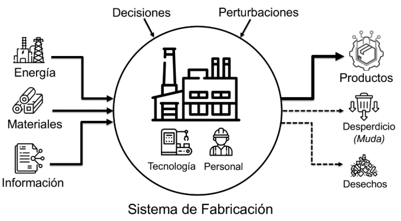
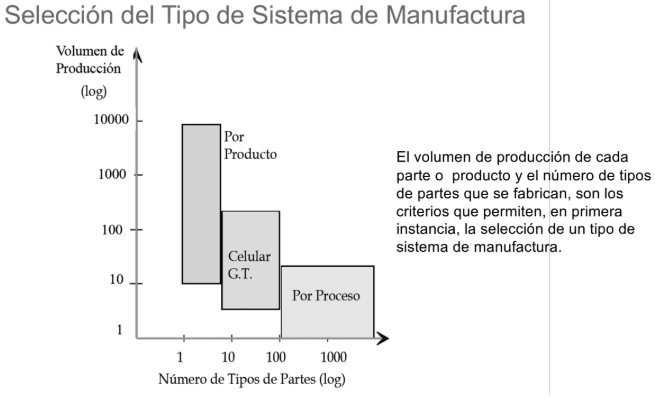

# Gestion de produccion automatizada

## Sistemas de fabricacion

Podemos verlo como un sistema de "caja negra" en el cual ingresamos con materias primas o materiales a procesar y sacamos productos o servicios.

Todos los procesos se pueden catalogar en distintos tipos de produccion: Continua, Discreta, Por lotes y artesanal o por proyecto.

Ademas, los tipos de sistemas son:

| Sistema                 | Características                                                                                                 | Ejemplo                                          |
| ----------------------- | --------------------------------------------------------------------------------------------------------------- | ------------------------------------------------ |
| **Posición fija**       | El producto permanece en un lugar y los recursos se desplazan hacia él. Se usa para productos grandes o únicos. | Construcción de barcos o edificios.              |
| **Por producto**        | Las máquinas se organizan siguiendo la secuencia de fabricación. Alta producción y poca variedad.               | Línea de ensamblaje de automóviles.              |
| **Por proceso**         | Las máquinas se agrupan según su función. Alta variedad y diferentes rutas de producción.                       | Taller de mecanizado.                            |
| **Manufactura celular** | Las máquinas se agrupan para fabricar una familia de productos similares. Busca reducir recorridos y tiempos.   | Célula para fabricar diferentes tipos de piezas. |

## Indicadores de desempeño

Algunos de los parametros mas usados para las operaciones de fabricacion, tenemos:

### *Takt Time*

Se define como la cadencia con la cual un producto debe ser fabricado para satisfacer la demanda. ***ritmo al cual un producto debe ser fabricado***

$$T = \frac{T_D}{D}$$

Donde $T_D$ es el tiempo neto de trabajo disponible por periodo y $D$ es la demanda (unidades requeridas)

### Tiempo de ciclo *Tc*

Es el tiempo asociado a cada estacion para completar su tarea (Tiempo de procesamiento en una estación)

$$T_C = T_O + T_h + T_{th}$$

Donde tenemos que $T_O$ es el tiempo de operacion, $T_h$ es el tiempo de manipulacion de la parte y por ultimo $T_{th}$ es el tiempo de manipulacion de la herramienta

### Tasa de produccion *Rp*

Es el numero de partes producidas por hora:

$$T_b = T_{su} + QT_C$$
$$T_p = \frac{T_b}{Q}$$
$$R_P = \frac{60}{T_p}$$

Con

- $T_b$: Tiempo de produccion de un lote (min)
- $T_{su}$: Tiempo de alistamiento (min)
- $T_C$: Tiempo de ciclo (min)
- $T_p$: Tiempo de produccion por unidad (min)
- Q: Tamaño del lote(unidades)
- $R_p$: Tasa de produccion (unidades por hora)

### Capacidad de produccion *PC*

Es la maxima tasa de salida que una fabrica es capaz de producir asumiendo determinadas condiciones de operacion

$$PC = n \dot S \dot H \dot R_P$$

- $PC$: Capacidad de produccion (Unidades/Semana)
- $n$: Numero de estaciones
- $S$: Numero de turnos por periodo (Turnos/semana)
- $H$: Numero de horas por turno (hora/turno)
- $R_P$: Tasa de produccion en cada estacion (Unidades/hora)

### Utilizacion *U*

Es la fraccion en la que se esta usando la planta de produccion con relacion a la capacidad PC

$$U = \frac{Q}{PC} x 100%$$

Con Q como la cantidad realmente producida y PC es la capacidad previamente definida

### Tiempo total de manufactura *MLT*

### Trabajo en proceso *(work in process) WIP*

## Concepto de KPI *Key Performance Indicator*

Es una metrica cuantitativa que muestra como un equipo de trabajo o un sistema de produccion progresa hacia sus objetivos empresariales.

Tenemos el OEE, 