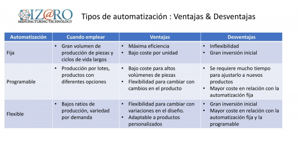

# 🕋 Celdas de manufactura robotizadas

## Automatizacion

- **ISA:** International Society of Automation -> Creacion y aplicacion de tecnologias para monitorear y controlar la produccion y entrega de productos y servicios

### Aplicaciones de automatizacion

- Procesos industriales
- Servicios
- Productos
- Microelectronica
- Viviendas

### Tipos de automatizacion

Se basa principalmente en los

- **Automatizacion fija:** Configuracion del proceso de fabricacion permanece fija (ideal para completar un mismo conjunto de tareas repetidamente). Ensamble de vehiculos o produccion de motores, etc...
- **Automatizacion flexible:** Permite la produccion de diferentes tipos de productos sin necesidad de una reprogramacion compleja. Maquinas que en cierto volumen de produccion puede cambiar.
- **Automatizacion Programable:** Equipos controlados mediante programacion para la produccion en lotes, facilita la modificacion de productos o procesos mediante la modificacion del programa de control. La variedad de productos es alta y el volumen bajo. 

Tambien se puede hablar de produccion manual lo cual tiene baja variedad y bajo volumen de produccion, ademas de

### Metodologias o Filosofias de produccion

- Otras filosofias y metodologias de gestion similares al *Just In Time* (JIT) y *Lean Manufacturing* orientadas a la eficiencia y demas caracteristicas incluyen Kaizen, TOC, Six Sigma, TPM y las 5S. Se enfocan en:
    - Optimizar procesos
    - Reducir costos
    - Elevar calidad

